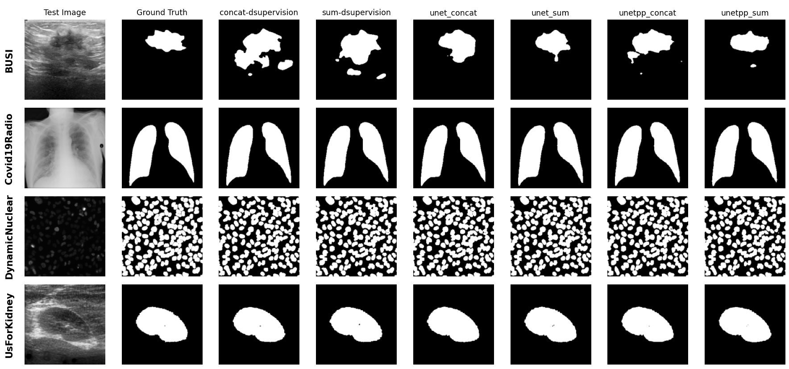

# 
<div id="top"></div>
<h3 align="center">CONCATENATION AND SUMMATION OPERATION IN UNET AND UNET++</h3>
</div>

## About the project

In this experiment, we explore an alternative method called element-wise summation, which adds the feature maps together instead of joining them. We compare how concatenation and summation affect the performance of UNet and UNet++, and see if summation can make the models simpler while still keeping good segmentation results.


## Repo structure

- ***source:***  
All source code of the project

- ***source/tool:***  
Scripts to prepare/preprocess datasets

- ***results:***   
Best models and evaluation metrics from training process for each dataset

- ***nb:***  
Notebooks created during the development phase of the project

## Trained models
https://git.oth-aw.de/3348/deep_vision_models

## Usuage
### Prepare data
1. Download Hi-gMISnet all dataset from Kaggle for BUSI dataset:

Go into `data` folder, run this command:
```
curl -L -o medical-image-segmentation-datasets-hi-gmisnet.zip https://www.kaggle.com/api/v1/datasets/download/tushartalukder/medical-image-segmentation-datasets-hi-gmisnet

unzip medical-image-segmentation-datasets-hi-gmisnet.zip
```

2. Download and prepare other datasets:

Go into `source/tool`, run file `export_medsegbench.py`:
```
python export_medsegbench.py --out_root ../../data --size 256
```

3. The data folder should look like this:

```text
data
    Hi-gMISnet_all_dataset
        BUSI
            train_folder
            val_folder
            test_folder
        ...
        ...

    DynamicNuclear
        train
        val
        test
    UsForKidney
        train
        val
        test
    Covid19Radio
        train
        val
        test
```

### Train

Go to `source` folder:

Train UNet and UNet Summation:
```
python train_unet.py
```

Train UNet++ and UNet++ Summation without deep supervision:
```
python train_unetpp.py
```

Train UNet++ and UNet++ Summation with deep supervision:
```
python train_deep_supervision.py
```

Example to train on school GPU Server

```
nohup python train_unetpp.py > ../results/train_unetpp.log 2>&1 &
```

### Inference 


Inference UNet and UNet Summation:
```
python evaluate_unet.py
```

Inference UNet++ and UNet++ Summation without deep supervision:
```
python evaluate_unetpp.py
```

Inference UNet++ and UNet++ Summation with deep supervision:
```
python evaluate_deep_supervision.py
```

Example images predictions from each dataset and each model


## Contributors
| Student name        | Code   | Email              |
|---------------------|--------|--------------------|
| Xusheng Guo         | 3348   | x.guo@oth-aw.de    |
| Tran Thai Duc Hieu  | 8f95   | t.tran@oth-aw.de   |

This project is owned by the team, **please do not copy**. 

<p align="right">(<a href="#top">back to top</a>)</p>


